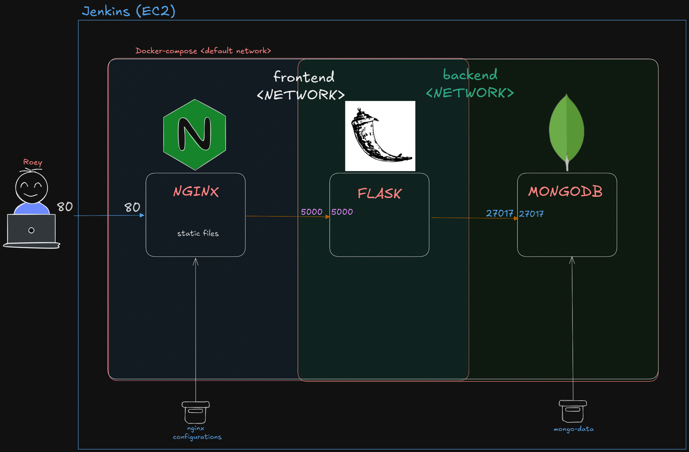

# Application repository

This repository contains the source code for the portfolio project's application. The application is built using React and Flask, exposing a REST API and interacting with a MongoDB database. The repository also includes a Jenkinsfile for automating the CI/CD pipeline.

# App Demo


# Jenkins Pipeline


# Three-tier Architecture




## Structure

```text
├── backend                    # Backend service for the application
│   ├── app.py                 # Main application file defining Flask API
│   ├── Dockerfile             # Dockerfile to build backend container
│   ├── Dockerfile.test        # Dockerfile for backend testing
│   ├── requirements.txt       # Dependencies for the Flask application
│   └── tests                  # Unit tests for the backend
│       ├── __init__.py        # Marks tests directory as a package
│       └── test_app.py        # Test cases for Flask app
├── docker-compose.yaml        # Configuration for multi-container Docker setup
├── e2e                        # End-to-end testing setup
│   ├── Dockerfile.e2e         # Dockerfile for E2E testing environment
│   ├── e2e.test.js            # E2E test cases written in JavaScript
│   ├── package.json           # Node.js dependencies for E2E testing
│   └── package-lock.json      # Locks dependencies for E2E environment
├── frontend                   # React-based frontend application
│   ├── Dockerfile             # Dockerfile to build frontend container
│   ├── Dockerfile.test        # Dockerfile for frontend testing
│   ├── nginx.conf             # Nginx configuration for serving frontend
│   ├── package.json           # Dependencies and scripts for React app
│   ├── package-lock.json      # Locks dependencies for React app
│   ├── public                 # Static assets and public files
│   │   ├── index.html         # Main HTML file for React app
│   │   └── todoslogo.png      # Image asset used in the app
│   └── src                    # React source code
│       ├── App.jsx            # Main React component
│       ├── index.jsx          # Entry point for rendering React app
│       ├── styles.css         # Stylesheet for the app
│       ├── tests              # Unit tests for React components
│       │   ├── App.test.jsx   # Tests for App component
│       │   └── Todo.test.jsx  # Tests for Todo component
│       └── Todo.jsx           # Component for displaying todos
├── images                     # Images for documentation and visualizations
│   ├── jenkins_pipeline.png   # Diagram of Jenkins pipeline
│   └── website_demo.png       # Screenshot of the application demo
├── Jenkinsfile                # Defines Jenkins pipeline stages
└── README.md                  # Main documentation file
```