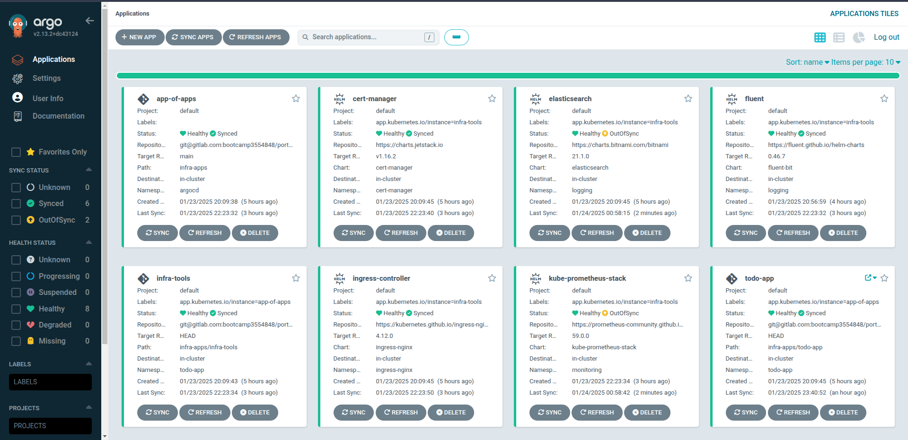
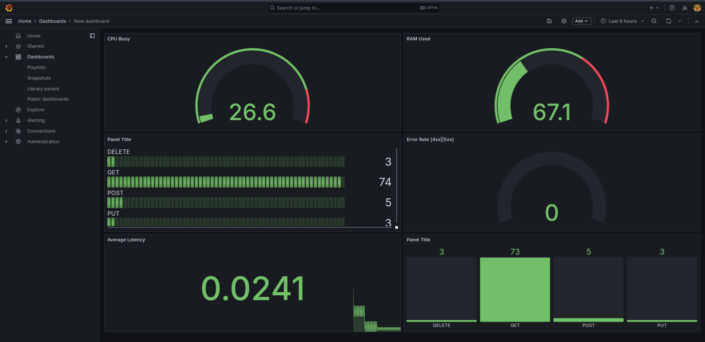
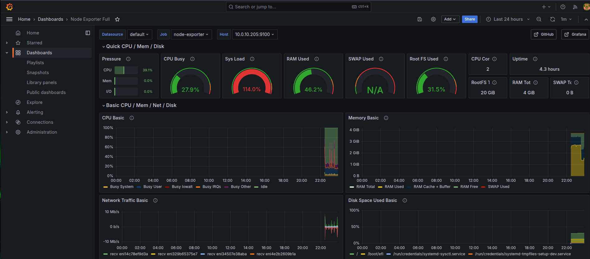
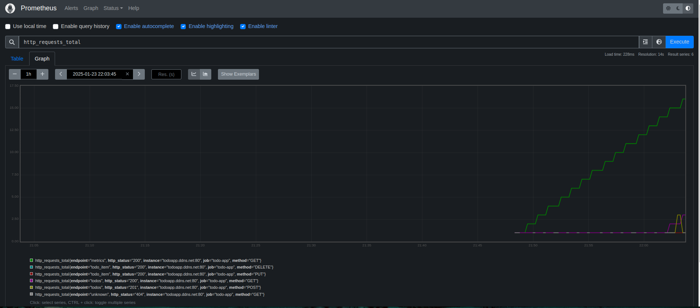
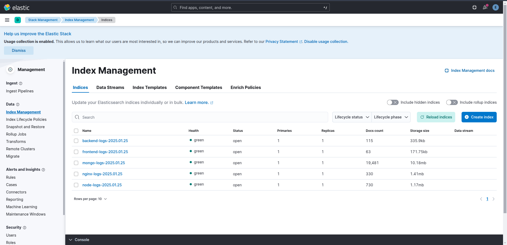

# GitOps Repository

This repository contains the GitOps configuration for deploying and managing the application and the infrastructure applications and services on a Kubernetes cluster using Argo CD.

# Full Architecture


# Argocd View



# Grafana Dashboard






# Kibana Dashboard




## Structure

```text
.
├── infra-app-of-apps.yaml                          # Root configuration file for deploying multiple applications using ArgoCD
├── infra-apps                                      # Directory containing configurations for infrastructure and applications
│   ├── infra-tools                                 # Directory for infrastructure tool configurations
│   │   ├── cert-manager-app.yaml                   # Configuration for deploying Cert-Manager
│   │   ├── elasticsearch.yaml                      # Configuration for deploying Elasticsearch
│   │   ├── fluentd.yaml                            # Configuration for deploying Fluentd (log collection)
│   │   ├── ingress-controller-app.yaml             # Configuration for deploying an Nginx ingress controller
│   │   └── prometheus-stack.yaml                   # Configuration for deploying Prometheus and Grafana stack
│   ├── infra-tools.yaml                            # ArgoCD Application manifest for deploying all infra-tools as a single entity
│   ├── todo-app                                    # Directory for the Todo application Helm chart and resources
│   │   ├── charts                                  # Directory containing pre-packaged Helm charts
│   │   │   └── mongodb-16.4.0.tgz                  # Helm chart package for MongoDB
│   │   ├── Chart.yaml                              # Metadata file for the Todo application Helm chart
│   │   ├── templates                               # Directory for Kubernetes manifests templated via Helm
│   │   │   ├── backend-service.yaml                # Service definition for the backend
│   │   │   ├── cluster-issuer.yaml                 # Cert-Manager configuration for issuing certificates
│   │   │   ├── configmap.yaml                      # Configuration map for the application
│   │   │   ├── frontend-service.yaml               # Service definition for the frontend
│   │   │   ├── ingress.yaml                        # Ingress resource for routing external traffic
│   │   │   ├── mongodb-storage-class.yaml          # Storage class definition for MongoDB
│   │   │   ├── service-monitor.yaml                # Monitoring configuration for Prometheus
│   │   │   ├── workload-backend-deployment.yaml    # Deployment definition for the backend workload
│   │   │   └── workload-frontend-deployment.yaml   # Deployment definition for the frontend workload
│   │   └── values.yaml                             # Helm chart values file for configuring the Todo application
│   ├── todo-app.yaml                               # ArgoCD Application manifest for deploying the Todo app
│   └── values                                      # Directory for custom values files
│       ├── elastic-values.yaml                     # Custom values for configuring Elasticsearch
│       ├── fluent-values.yaml                      # Custom values for configuring Fluentd
│       └── prometheus-values.yaml                  # Custom values for configuring Prometheus and Grafana
└── README.md                                       # Main documentation file explaining the infrastructure and application deployment

```