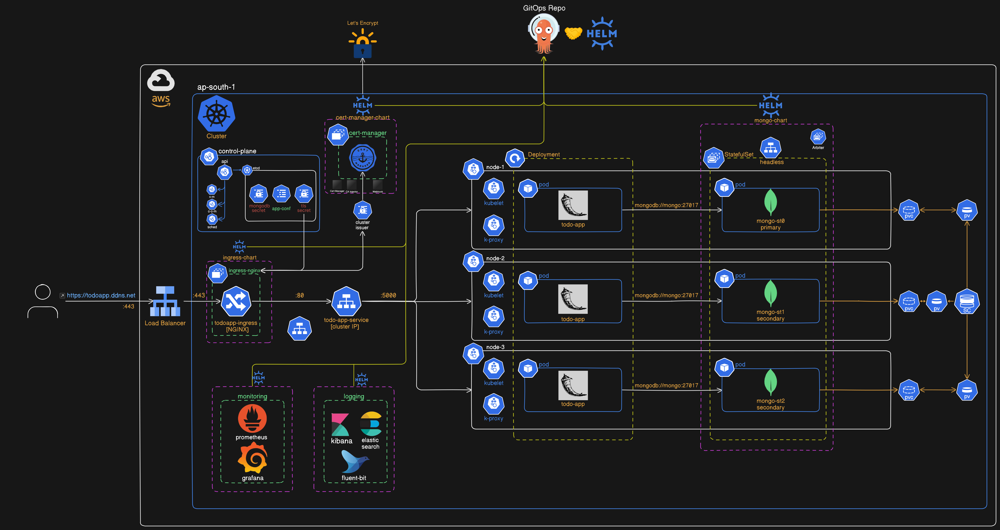

# Infrastructure Repository

This repository contains the infrastructure as code (IaC) configuration for deploying and managing the cloud-based infrastructure required for the portfolio project. The infrastructure setup is based on AWS, using Terraform to provision and manage resources.

# EKS Overview



## Repository Structure

```text
.
├── environments                # Terraform configurations for different environments
│   ├── dev                     # Development environment configuration
│   │   ├── main.tf             # Main Terraform configuration file for resources
│   │   ├── outputs.tf          # Output definitions for resource attributes
│   │   ├── provider.tf         # Provider configuration (AWS)
│   │   ├── terraform.tfvars    # Environment-specific variable values
│   │   ├── variables.tf        # Input variable definitions
│   │   └── versions.tf         # Terraform and provider version constraints
│   ├── prod                    # Production environment configuration
│   │   ├── main.tf             # Main Terraform configuration file for resources
│   │   ├── outputs.tf          # Output definitions for resource attributes
│   │   ├── provider.tf         # Provider configuration (AWS)
│   │   ├── terraform.tfvars    # Environment-specific variable values
│   │   ├── variables.tf        # Input variable definitions
│   │   └── versions.tf         # Terraform and provider version constraints
│   └── staging                 # Staging environment configuration
│       ├── main.tf             # Main Terraform configuration file for resources
│       ├── outputs.tf          # Output definitions for resource attributes
│       ├── provider.tf         # Provider configuration (AWS)
│       ├── terraform.tfvars    # Environment-specific variable values
│       ├── variables.tf        # Input variable definitions
│       └── versions.tf         # Terraform and provider version constraints
├── images                      # Directory for storing images or visual diagrams
├── modules                     # Reusable Terraform modules
│   ├── ebs-csi-driver          # Module for provisioning EBS CSI driver
│   │   ├── main.tf             # Main configuration for the EBS CSI driver
│   │   ├── outputs.tf          # Outputs for the EBS CSI driver
│   │   └── variables.tf        # Input variables for the EBS CSI driver
│   ├── eks-cluster             # Module for creating the EKS cluster
│   │   ├── main.tf             # Main configuration for the EKS cluster
│   │   ├── outputs.tf          # Outputs for the EKS cluster
│   │   └── variables.tf        # Input variables for the EKS cluster
│   ├── k8s-secrets             # Module for managing Kubernetes secrets
│   │   ├── main.tf             # Main configuration for Kubernetes secrets
│   │   ├── outputs.tf          # Outputs for Kubernetes secrets
│   │   └── variables.tf        # Input variables for Kubernetes secrets
│   ├── node-group              # Module for provisioning Kubernetes node groups
│   │   ├── main.tf             # Main configuration for the node group
│   │   ├── outputs.tf          # Outputs for the node group
│   │   └── variables.tf        # Input variables for the node group
│   └── vpc                     # Module for creating a VPC
│       ├── main.tf             # Main configuration for the VPC
│       ├── outputs.tf          # Outputs for the VPC
│       └── variables.tf        # Input variables for the VPC
├── README.md                   # Documentation file for this repository
├── scripts                     # Shell scripts for automation tasks
│   ├── build.sh                # Script to build and provision resources
│   └── destroy.sh              # Script to destroy resources and clean up
```